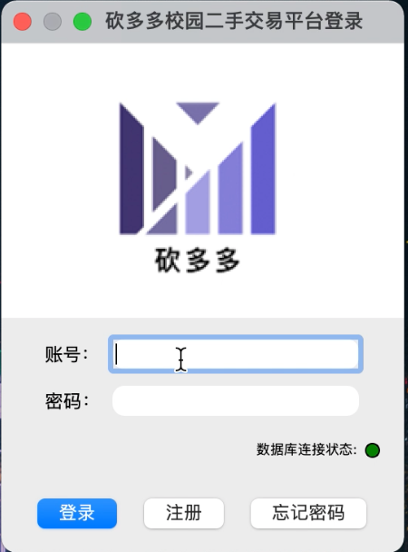
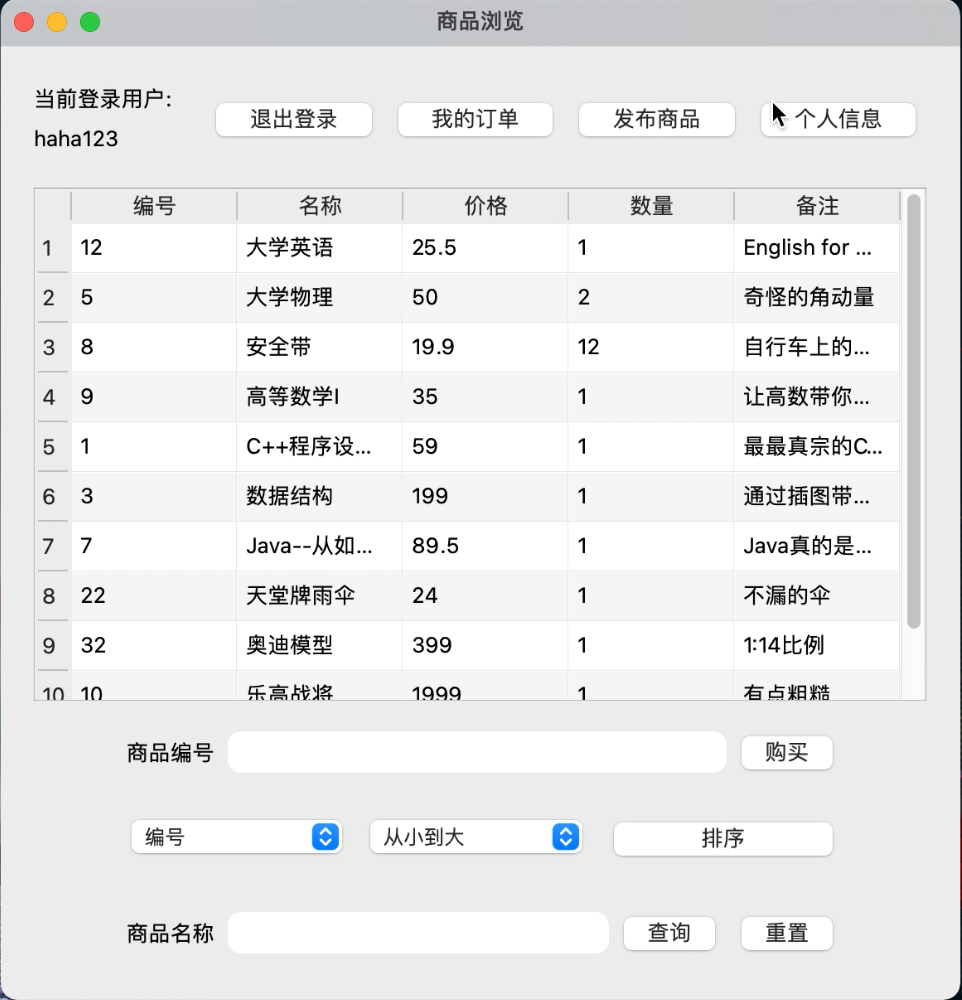
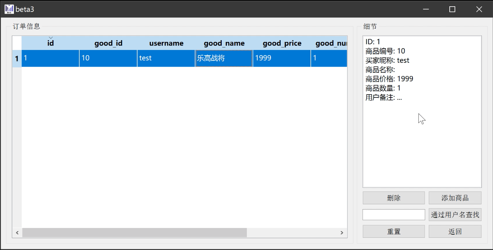

# 砍多多校园二手交易平台

> 采用基于C++的QT框架进行跨平台开发，花了三四天稍微学习了一些qt的基本语法和一些工具的使用，开发了这个微型平台。  
> 在初期技术选型过程中，其实这样一个东西更适合制作一个网站，vue+springboot是个不错的选择。但作为本学期的课程设计，需要兼顾到学习的连贯性，因此才考虑使用qt来进行开发。

由于制作匆忙，没有太多地进行更新，存在无数bug，包括一些细节的使用也存在问题。如后期有时间可能会继续迭代。

---

## 编译

通过qmake进行编译。由于开发平台是在mac上，存在sdk版本问题，因此如需在其他平台进行编译需要对pro文件进行修改。

具体修改如下:
> 删除如下内容
```
QMAKE_MACOSX_DEPLOYMENT_TARGET = 10.15
CONFIG += sdk_no_version_check
```
> 在主函数中添加如下内容以适配高分屏
```
if(QT_VERSION>=QT_VERSION_CHECK(5,6,0))
    QCoreApplication::setAttribute(Qt::AA_EnableHighDpiScaling);
```

---

## 使用指南

- 系统第一次启动会自动生成三个用户
    - admin/123456(超管用户会进入后台管理界面)
    - haha123/haha123
    - test/123456
- 由于Windows对于高分屏的优化差，在某些显示器上可能出现文字压缩、挤压等错误，MacOS和Linux上暂未发现此问题。
- 本软件采用Sqlite数据库离线存储数据，如后期有上线需要，可更换为其他如Mysql、Oracle、Redis、Sql Server等数据库。

---

## 效果截图


